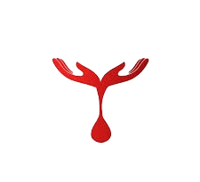

# LifeStream - Blood Donation Management System



LifeStream is a comprehensive blood donation management system that connects blood donors with those in need, facilitates blood donation campaigns, and streamlines the entire blood donation process.

## 🌟 Features

### For Donors
- **User Registration & Authentication** - Secure sign-up and sign-in system
- **Donation History Tracking** - Keep track of all your blood donations
- **Appointment Booking** - Schedule blood donation appointments
- **Eligibility Checker** - Check if you're eligible to donate blood
- **User Profile Management** - Manage your personal information and preferences

### For Organizations
- **Campaign Management** - Organize blood donation camps
- **Volunteer Registration** - Register volunteers for blood donation events
- **Blood Availability Tracking** - Monitor blood stock levels by type

### General Features
- **News & Blog Section** - Stay updated with blood donation news and stories
- **FAQ Section** - Common questions and answers about blood donation
- **Contact & Feedback** - Get in touch and provide feedback
- **About Us** - Learn more about our mission and team

## 🚀 Tech Stack

### Frontend
- **HTML5** - Semantic markup structure
- **CSS3** - Styling and responsive design
- **JavaScript** - Interactive functionality
- **Bootstrap 4** - UI components and responsive grid
- **Font Awesome** - Icons and visual elements

### Backend
- **Node.js** - Runtime environment
- **Express.js** - Web application framework
- **MongoDB** - NoSQL database
- **Mongoose** - MongoDB object modeling

### Dependencies
- `express` - Web framework for Node.js
- `mongoose` - MongoDB object modeling tool
- `body-parser` - Parse incoming request bodies
- `cors` - Enable Cross-Origin Resource Sharing
- `mongodb` - MongoDB driver for Node.js

## 📦 Installation

### Prerequisites
- Node.js (v14 or higher)
- MongoDB (local installation or MongoDB Atlas)
- Git

### Setup Instructions

1. **Clone the repository**
   ```bash
   git clone <repository-url>
   cd LifeStream-Project
   ```

2. **Install dependencies**
   ```bash
   npm install
   ```

3. **Configure Database**
   - Make sure MongoDB is running on your system
   - Update the database connection in `db.js` if necessary
   - Default connection: `mongodb://localhost:27017/lifestream`

4. **Start the application**
   ```bash
   npm start
   ```

5. **Access the application**
   - Open your browser and navigate to `http://localhost:3000`
   - The main page will be served from `pages/index.html`
   - All other pages are accessible at `http://localhost:3000/pages/[page-name].html`

## 📁 Project Structure

```
LifeStream-Project/
├── css/                    # Stylesheets
│   ├── style.css          # Main styles
│   └── modal.css          # Modal-specific styles
├── forms/                  # Form handling scripts
│   ├── appointment-form.js
│   ├── organize-camp-form.js
│   ├── searchBloodAvailability.js
│   ├── signup-form.js
│   └── volunteer-form.js
├── images/                 # Static images and assets
├── javascript/            # Frontend JavaScript
│   └── form.js
├── js/                    # Additional JavaScript files
│   └── script.js
├── models/                # Database models
│   ├── Appointment.js     # Appointment schema
│   ├── bloodAvailabilitySchema.js
│   ├── OrganizeCamp.js    # Campaign schema
│   ├── User.js           # User schema
│   └── Volunteer.js      # Volunteer schema
├── pages/                 # HTML pages
│   ├── index.html         # Home page
│   ├── Sign-Up.html       # User registration
│   ├── Sign-In.html       # User login
│   ├── User-Profile.html  # User dashboard
│   ├── Appointment.html   # Book donation appointment
│   ├── BloodAvailability.html # Check blood stock
│   ├── Campaigns.html     # View donation campaigns
│   ├── Organize-Camp.html # Organize new campaign
│   ├── Volunteer.html     # Volunteer registration
│   ├── DonationHistory.html # Track donation history
│   ├── Donation-Eligibility-Checke.html # Check eligibility
│   ├── Blog.html          # News and articles
│   ├── FAQ.html           # Frequently asked questions
│   ├── About-Us.html      # About the organization
│   ├── Contact-Us.html    # Contact information
│   ├── Feedback.html      # User feedback form
│   └── News.html          # News page
├── video/                 # Video assets
├── db.js                 # Database configuration
├── server.js             # Main server file
├── package.json          # Dependencies and scripts
└── README.md             # Project documentation
```

## 🔗 API Endpoints

### User Management
- `POST /api/signup` - Register new user
- `POST /api/signin` - User authentication

### Volunteers
- `POST /api/volunteers` - Register volunteer

### Appointments
- `POST /api/appointments` - Book appointment

### Campaigns
- `POST /api/organize-camp` - Organize blood donation camp

### Blood Availability
- `GET /api/blood-availability` - Check blood availability
- `POST /api/blood-availability` - Update blood stock

## 📄 Pages

All HTML pages are organized in the `pages/` folder:

- **pages/index.html** - Home page
- **pages/Sign-Up.html** - User registration
- **pages/Sign-In.html** - User login
- **pages/User-Profile.html** - User dashboard
- **pages/Appointment.html** - Book donation appointment
- **pages/BloodAvailability.html** - Check blood stock
- **pages/Campaigns.html** - View donation campaigns
- **pages/Organize-Camp.html** - Organize new campaign
- **pages/Volunteer.html** - Volunteer registration
- **pages/DonationHistory.html** - Track donation history
- **pages/Donation-Eligibility-Checke.html** - Check eligibility
- **pages/Blog.html** - News and articles
- **pages/FAQ.html** - Frequently asked questions
- **pages/About-Us.html** - About the organization
- **pages/Contact-Us.html** - Contact information
- **pages/Feedback.html** - User feedback form
- **pages/News.html** - News and updates

## 🛠️ Development

### Running in Development Mode
```bash
# Install dependencies
npm install

# Start the server with auto-restart (if nodemon is installed)
npx nodemon server.js

# Or use the regular start command
npm start
```

### Database Schema
The application uses MongoDB with the following main collections:
- **Users** - Store user account information
- **Volunteers** - Volunteer registration data
- **Appointments** - Blood donation appointments
- **OrganizeCamp** - Blood donation campaigns
- **BloodAvailability** - Blood stock information

## 🤝 Contributing

1. Fork the repository
2. Create a feature branch (`git checkout -b feature/new-feature`)
3. Commit your changes (`git commit -am 'Add new feature'`)
4. Push to the branch (`git push origin feature/new-feature`)
5. Create a Pull Request

## 📝 License

This project is licensed under the ISC License.

## 📧 Contact

For questions, suggestions, or support, please reach out through the Contact Us page or create an issue in the repository.

## 🎯 Mission

LifeStream aims to bridge the gap between blood donors and recipients by providing a user-friendly platform that makes blood donation easier, more accessible, and more organized. We believe that every drop counts in saving lives.

---

**Made with ❤️ for the community**
